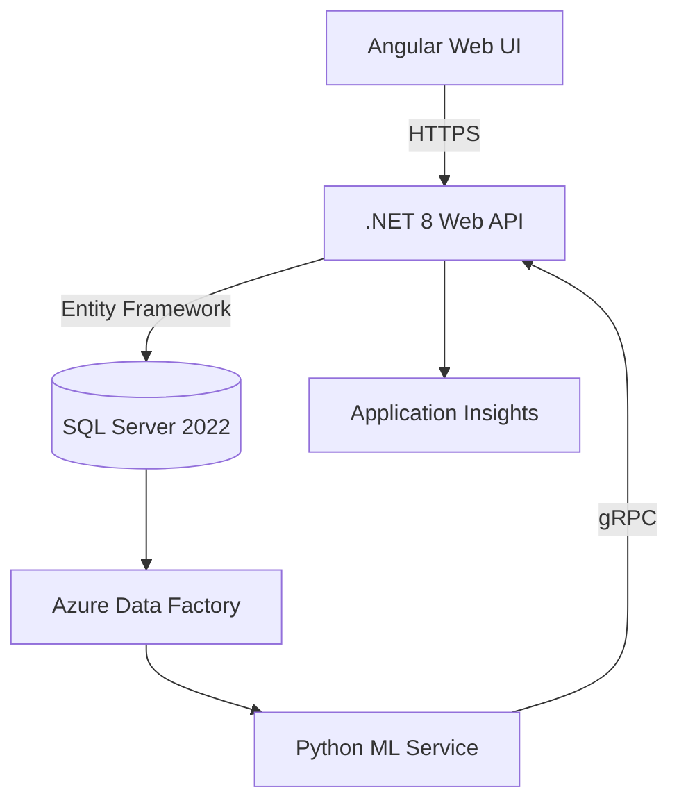

The architecture diagram above illustrates the core components and their interactions:

- Angular Web UI handles all client-side operations and user interactions
- .NET 8 Web API serves as the central orchestrator, managing business logic and security
- SQL Server 2022 stores transactional data and maintains data consistency
- Azure Data Factory manages ETL processes and data transformations
- Python ML Service handles predictive analytics and machine learning operations
- Application Insights monitors system performance and health metrics

The bidirectional arrows indicate real-time communication flows, particularly between the Web API and ML Service, enabling immediate feedback for predictive analytics operations.

## Executive Summary

This document outlines the technical implementation of a healthcare revenue cycle predictive analytics system, designed to optimize medical billing processes through advanced machine learning and automation.

## System Architecture

The system follows a layered architecture pattern, with clear separation of concerns and scalable components. Each layer handles specific responsibilities while maintaining loose coupling through standardized interfaces.

## Environment Configuration

Before implementing the core functionality, proper environment setup is crucial. Here's the enhanced infrastructure configuration:

```powershell
# Infrastructure Setup Script
$chocoPackages = @(
    'dotnet-sdk',
    'sql-server-express',
    'azure-data-factory-v2-integration-runtime',
    'python3',
    'nodejs-lts'
)

foreach ($pkg in $chocoPackages) {
    choco install $pkg -y --confirm
}

# Configure SQL Server with enhanced security
$sqlScript = @"
CREATE LOGIN [AppUser] WITH PASSWORD=N'StrongP@ssw0rd!', 
DEFAULT_DATABASE=[RevenueCycleDB],
CHECK_EXPIRATION=OFF,
CHECK_POLICY=ON;
GO

-- Create database-specific role
CREATE ROLE [RevenueCycleAdmin];
GRANT SELECT, INSERT, UPDATE, DELETE ON DATABASE::RevenueCycleDB TO [RevenueCycleAdmin];
ALTER SERVER ROLE [RevenueCycleAdmin] ADD MEMBER [AppUser];
GO
"@

$sqlScript | Out-File -Path "C:\DBScripts\CreateLogin.sql"
Invoke-Sqlcmd -InputFile "C:\DBScripts\CreateLogin.sql" -ServerInstance "localhost\SQLEXPRESS"
```

## Core Application Implementation

The AR Calculation Engine implements business day logic with federal holiday consideration:

```csharp
public class ArCalculator : IArCalculator
{
    private readonly DateOnly[] _federalHolidays;
    
    public ArCalculator(IHolidayProvider holidayProvider)
    {
        _federalHolidays = holidayProvider.GetFederalHolidays();
    }

    public int CalculateARDays(DateOnly serviceDate, DateOnly paymentDate)
    {
        int days = 0;
        var currentDate = serviceDate;
        
        while (currentDate <= paymentDate)
        {
            // Skip weekends and holidays
            if (!IsWeekend(currentDate) && !IsFederalHoliday(currentDate))
            {
                days++;
            }
            currentDate = currentDate.AddDays(1);
        }
        
        return days;
    }

    private bool IsWeekend(DateOnly date) => 
        date.DayOfWeek == DayOfWeek.Saturday || date.DayOfWeek == DayOfWeek.Sunday;

    private bool IsFederalHoliday(DateOnly date) =>
        _federalHolidays.Any(holiday => holiday == date);
}
```

## Machine Learning Integration

The ML service uses XGBoost for denial prediction with feature engineering:

```python
import xgboost as xgb
import pandas as pd
from sklearn.preprocessing import StandardScaler

class DenialPredictor:
    def __init__(self):
        self.model = None
        self.scaler = StandardScaler()
        
    def train_model(self, training_data: pd.DataFrame):
        # Feature engineering
        features = pd.get_dummies(training_data.drop(['denied', 'amount'], axis=1))
        target = training_data['denied']
        
        # Scale numerical features
        numerical_features = features.select_dtypes(include=['int64', 'float64'])
        features[numerical_features.columns] = self.scaler.fit_transform(numerical_features)
        
        # Train XGBoost model with optimized parameters
        self.model = xgb.XGBClassifier(
            max_depth=6,
            learning_rate=0.1,
            n_estimators=100,
            gamma=0.25,
            subsample=0.8,
            colsample_bytree=0.8,
            reg_alpha=0.5,
            reg_lambda=0.5,
            eval_metric='logloss'
        )
        
        self.model.fit(features, target)
        
    def predict(self, claim_data: pd.DataFrame) -> float:
        features = pd.get_dummies(claim_data)
        scaled_features = self.scaler.transform(features)
        return self.model.predict_proba(scaled_features)[:, 1][0]
```

## Security Implementation

Enhanced security configuration with JWT validation and rate limiting:

```csharp
services.AddAuthentication(JwtBearerDefaults.AuthenticationScheme)
    .AddJwtBearer(options =>
    {
        options.Authority = Configuration["Jwt:Issuer"];
        options.TokenValidationParameters = new TokenValidationParameters
        {
            ValidateIssuerSigningKey = true,
            IssuerSigningKey = new SymmetricSecurityKey(
                Encoding.UTF8.GetBytes(Configuration["Jwt:Secret"])),
                
            ValidateIssuer = true,
            ValidIssuer = Configuration["Jwt:Issuer"],
            
            ValidateAudience = true,
            ValidAudience = Configuration["Jwt:Audience"],
            
            ValidateLifetime = true,
            ClockSkew = TimeSpan.Zero
        };
    });

// Rate limiting middleware
app.UseRateLimiting(options =>
{
    options.AddFixedWindowLimiter(policyName: "apiLimit", 
        options: new FixedWindowRateLimiterOptions
        {
            Window = TimeSpan.FromMinutes(15),
            QueueProcessingOrder = QueueProcessingOrder.OldestFirst,
            QueueLimit = 100,
            Limit = 500 // requests per window
        });
});
```

## Monitoring & Maintenance

Comprehensive monitoring implementation with Application Insights:

```kusto
// Performance Monitoring Query
requests
| where timestamp > ago(24h)
| summarize 
    AvgDuration=avg(duration),
    ErrorCount=countif(success == false),
    RequestCount=count(),
    SuccessRate=round(todouble(countif(success == true)) / count() * 100, 2)
by operation_Name
| render columnchart

// Dependency Monitoring Query
dependencies
| where timestamp > ago(24h)
| summarize 
    AvgDuration=avg(duration),
    FailureRate=round(todouble(countif(success == false)) / count() * 100, 2)
by target, operation_Name
| render columnchart
```

## Deployment Pipeline

Automated deployment script with rollback capabilities:

```powershell
param(
    [ValidateSet('Dev','Staging','Prod')]
    [string]$Environment = "Dev",
    [string]$SqlInstance = "localhost",
    [switch]$Rollback
)

# Database Migration
dotnet ef migrations script --idempotent --output ".\Migrations\deploy.sql"
Invoke-Sqlcmd -ServerInstance $SqlInstance -InputFile ".\Migrations\deploy.sql"

# Backup existing deployment
$backupPath = "\\\\backups\$Environment-$((Get-Date).ToString('yyyyMMddHHmm'))"
Copy-Item -Path "\\api-server\$Environment" -Destination $backupPath -Recurse -Force

try {
    # Deploy new version
    dotnet publish ".\RevenueCycle.API.csproj" -c Release -o "\\api-server\$Environment"
    Restart-Service -Name "RevenueCycleAPI" -Force
    
    # Smoke Test
    $health = Invoke-RestMethod "http://api-server/$Environment/health"
    if ($health.status -ne "OK") {
        throw "Deployment verification failed"
    }
}
catch {
    Write-Error "Deployment failed: $_"
    
    # Roll back to previous version
    Remove-Item -Path "\\api-server\$Environment" -Recurse -Force
    Copy-Item -Path $backupPath -Destination "\\api-server\$Environment" -Recurse -Force
    
    throw "Deployment failed and rolled back"
}
```

This implementation provides a robust foundation for healthcare revenue cycle management, combining predictive analytics, automated workflows, and comprehensive monitoring. The system is designed for scalability and reliability while maintaining strict security standards required in healthcare environments.
